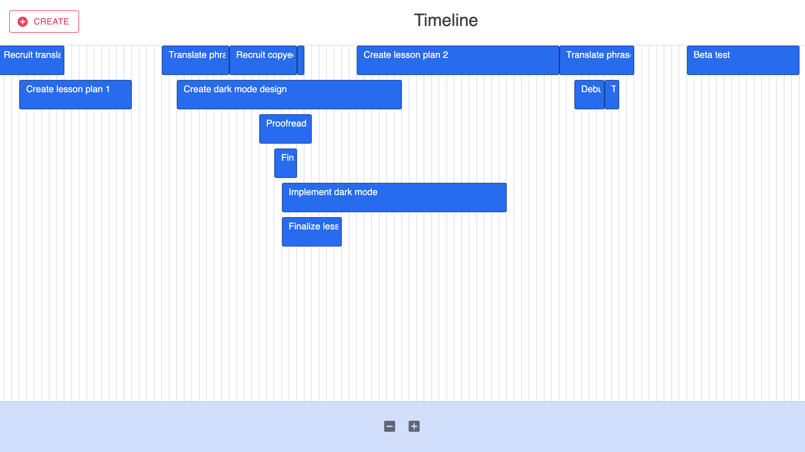
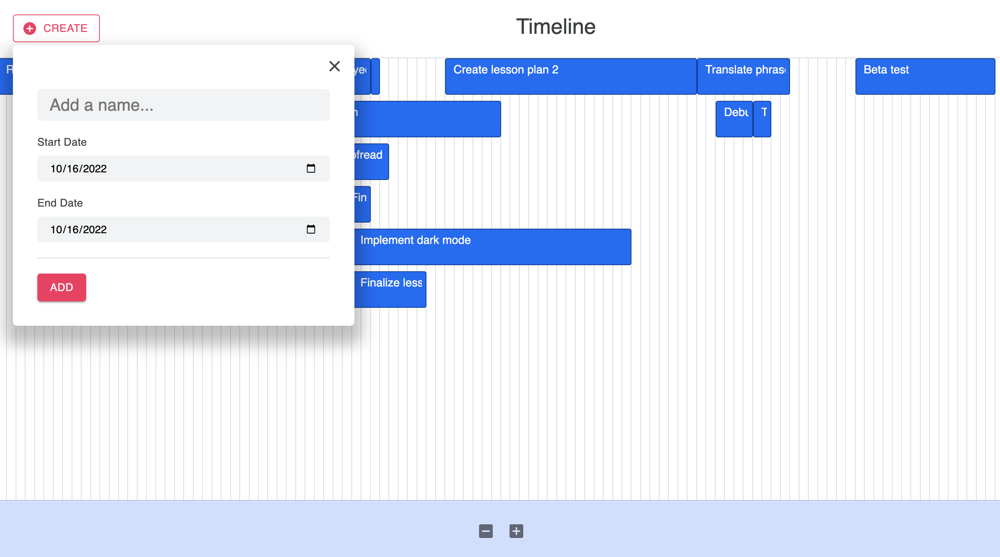
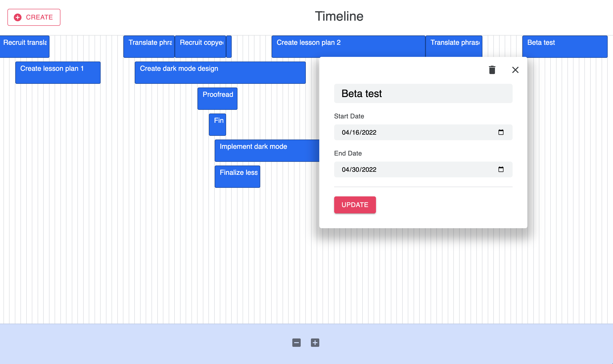
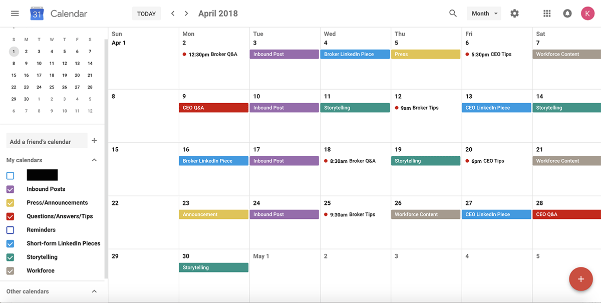

# Timeline
ReactJS application that allows users to view, edit, remove, and create new timeline items. Users can also zoom in and out on the timeline via footer icon buttons.

Here's the view when users create new items:

And when users edit existing items:

## Technologies Used
- [React](https://reactjs.org/)
- [React Context API](https://reactjs.org/docs/context.html) for state management
- [Material UI](https://mui.com/) for icons and buttons
- [Moment.js](https://momentjs.com/) for date formatting

## Running Locally
- Run `npm install` to install dependencies
- `npm start` to run a node server with your default browser

## What I like about this implementation
I like that users are able to create, view, update, and remove timeline items. I also like how most elements have `aria-labels` and `title` attributes, so if it isn't obvious what an icon does, on hovering, the user gets some useful visual feedback. I also like how on desktop devices, the modal will appear near the timeline item that was clicked, and that the modal closes if the user clicks outside of it.

I like how I used the same form component for creating new items and editing existing ones (just by passing different params to control what is displayed within the modal). I also like how I utilized hooks for referencing the application's context, toggling the modal, and detecting when users clicked outside of an element.

Overall, I like how relatively simple the components were and how I organized the various variables and attributes. I like that constants were organized in a separate file and that global CSS variables were managed within the `index.css` file.

## What I'd change
If I had more time, I would have implemented date headers to make it clear what dates existed within the timeline (without requiring users to click on individual items in order to get that information). I also would have included shortcut icons for editing and removing items right on the timeline item bar.

I thought that calculating elements for the CSS grid was a little clunky, and I didn't like how I used a combination of inline styles within React components as well as CSS files. I think using styled components would have kept the style management more consistent.

I also would have made changes to the modal behavior so it would work better for smaller devices and screens. At the moment, the calculations only work for desktop devices. Also, adding keyboard shortcuts would have made the application more accessible.

And lastly, I didn't get around to creating the drag and drop functionality. If I was tackling this project all over again, I would have first researched how to roll out drag and drop and then used that approach to influence my design decisions. With the current implementation, I based my design decisions off of creating the grid visual.

## Design decisions
I got a lot of inspiration for the look and feel of the application from Google Calendar:

When I first approached this project, I did some research on Gantt charts and drew inspiration from various projects that I found in [Codepen](https://codepen.io) and [CodeSandbox](https://codesandbox.io/). Based on some of the trends I saw, I decided I wanted to create some sort of grid, thus it made sense to use CSS grid for a grid layout.

For the functionality of the application, since I wanted to limit my time, I decided giving users CRUD functionality would work well. When it came to state management, again, because of time constraints, as well as the overall size of the application, it made sense to utilize the React Context API instead of something that was more robust like Redux.

## Testing
For testing, I would have written tests by using a combination of [Jest](https://jestjs.io/), [React Testing Library](https://testing-library.com/), and [Enzyme](https://enzymejs.github.io/). I would have written tests to ensure that elements were rendering properly as well as utilized unit tests to make sure various edge cases were covered for formatting data (i.e. selecting start and end dates) and when removing/adding new timeline items.
